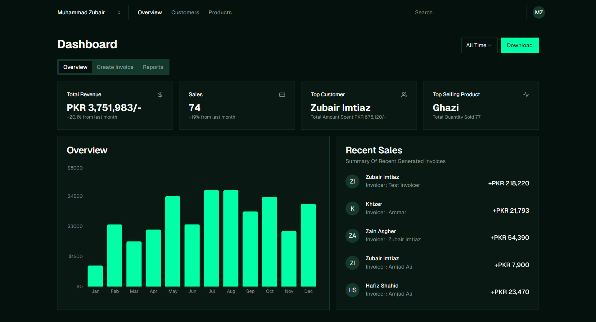
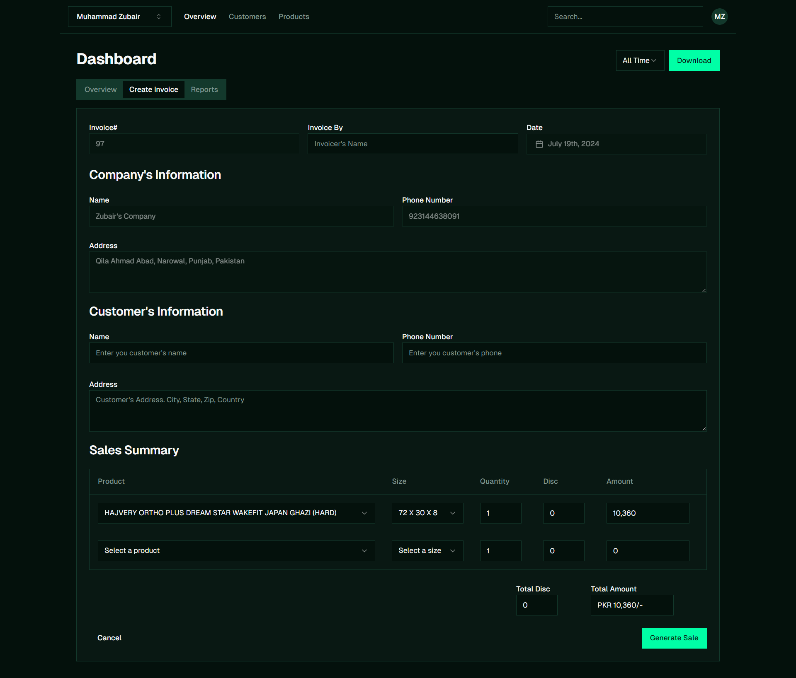
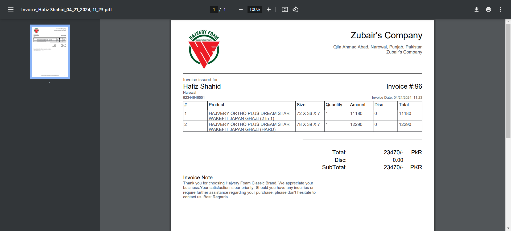

<h1>Trade Ease - Invoicing and Sales Analytics App</h1>

A full-stack app built with NextJs, TypeScript, Shadcn UI, and Supabase. It allows users to generate and manage invoices in PDF format, track all related data, and view detailed sales analytics through a dynamic dashboard.

## Features 

<li>
🔐 Secure sign-in and user management to keep each user's data safe.
</li>
<li>
🧾 Easily create and manage invoices for sold items.
</li>
<li>
📄 Download invoices in a PDF template.
</li>
<li>
📊 Keep track of all invoice data with comprehensive records.
</li>
<li>
📈 Get an overview of sales with a dynamic dashboard.
</li>
<li>
🗓️ Customize your dashboard view with daily, weekly, monthly, or all-time preference option.
</li>

## Technologies 
- `Next.Js`
- `TypeScript`
- `Supabase`
- `Shadcn UI`
- `Tailwind CSS`
- `InvoiceTemplateJsPdf`

## The Process 

I began by setting up the backend with Supabase. I designed a database schema featuring three key tables: `invoices` for all invoice data, `invoice_items` for individual items, and `profiles` for user company details.

For the frontend, I chose Next.js and Shadcn UI. Next.js helped me lay the foundation, while Shadcn UI allowed me to craft a sleek and functional user interface.

User authentication was powered by Supabase’s built-in features, ensuring a secure and seamless experience. I also created an onboarding screen to collect and store user company data in the `profiles` table.

Managing invoices was next. I integrated the Supabase API to both create and display invoices. To handle PDF generation, I used a library to create and format invoices based on a template.

Lastly, I built a dynamic sales dashboard to show analytics. By fetching data from Supabase,  I was able to populate the dashboard and display key metrics, providing users with valuable sales analytics.

Along the way, while building everything, I took notes on what I've learned so I don't miss out on it. I also documented the behind-the-scenes processes every time a feature was added.

It's funny how writing down what I've built made me understand it better. When I started documenting the features and processes, I realized that stepping back and reflecting on it really helps me get a clearer picture. It's a great habit to develop when learning something new.

## Images 

### Dashboard 

### Create Invoice 

### Invoice Pdf 

## Demo

You can view a fully working demo at [trade-ease.vercel.app](https://trade-ease.vercel.app/).

Test User Credentials:  
Email: Zubairimtiaz395@gmail.com  
Password: Zubi1234.

Feel free to generate an invoice with your name for test purposes—just don't go overboard and crash the system! 😅

## How it can be improved

<li>
<b>Public Sign-Ups: </b> Our current architecture can handle multiple user data concurrently, so the next step is to enable public sign-ups, allowing a broader user base to access and utilize the app.
</li>
<li>
   <b>Custom Product Management: </b>
Allow users to add their own products and customize product attributes, such as size, to better fit their specific needs.
</li>
<li>
<b>Additional PDF Templates: </b>
 Expand the range of available PDF invoice templates to offer more options for users, enabling them to choose or design templates that best suit their branding and presentation needs.
</li>
